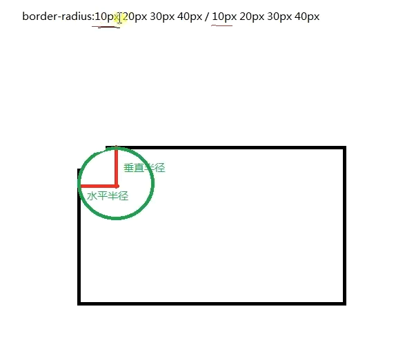

<!-- more -->

# 1.浏览器私有前缀

1.Gecko 内核，前缀为-moz-，火狐浏览器

2.Webkit 内核，前缀为-webkit-，也叫谷歌内核，chrome 浏览器最先使用，safari 浏览器也使用，国内很多浏览器也使用

3.Trident 内核，前缀为-ms-，也称为 IE 内核

4.Presto 内核，前缀为-o-，目前只有 opera 采用

# 2.圆角边框

border-radius：value; 四个角

value value；左上右下、右上左下

value value value value；左上角、右上角、右下角、左下角（顺时针排序）

# 3.阴影

- 文字阴影：text-shadow（阴影 1，阴影 2，。。。）
  - 阴影格式：
    - 第一个：横向偏移位置
    - 第二个：纵向偏移位置
    - 第三个：模糊的
    - 第四个：阴影的颜色
- 盒子阴影：box-shadow
  - 阴影格式：
    - 水平偏移位置
    - 垂直偏移位置
    - 模糊度
    - 外延值
    - 颜色（内置阴影）

# 4.线性渐变

Linear Gradient——向下/向上/向左/向右/对角方向

background：linear-gradient（direaction，color-stop1，color-stop2，...）

格式：

diireaction：to left、0deg

# 5.径向渐变

background：radial-gradient（center，shape，size，start-color，...，last-color）

默认情况下，渐变的中心是 center（表示在中心点），渐变的形状是 ellipse（表示椭圆形），可以说 circle（圆形），还可以使用 at x y 语法，都是从左上角为原点为参考点，xy 可以为像素也可以为百分比

# 6.2D 与 3D 动画

## transform 2D

translate 水平移动

rotate 旋转（顺时针）

scale 缩放

skew 倾斜

## transform 3D

# 7.过渡属性

使用 css 的属性值在一段时间内平滑的过渡

- 1.指定四个要素：
  - 过渡属性，如 background、color
  - 过渡所需时间
  - 过渡函数，即过渡的速度、方式等
  - 过渡延迟时间，表示开始执行的时间
- 2.触发过渡
  - 通过用户的行为触发，如点击、悬浮等

#### （1）过渡属性：transition-property：none|all|property

- 多个属性用逗号隔开
- 可设置过渡的属性
  - 颜色属性
  - 取值为数值的属性
  - 转换属性
  - 渐变属性
  - 阴影属性

#### （2）过渡时间：transition-duration：s|ms

默认为 0，意味着不会有效果，所以必须设置

#### （3）过渡函数：transition-timing-function

- 取值：
  - ease：默认，规定慢速开始，然后变快，然后慢速结束的过渡效果
  - linear：匀速
  - ease-in：规定以慢速开始，加速效果
  - ease-out：规定以慢速结束，减速效果
  - ease-in-out：规定以慢速开始和结束，先加速后减速效果

#### （4）过渡延迟：transition-delay：s|ms

改变元素属性值后多长时间开始执行过渡效果

#### （5）简写属性 transition

transition：property duration timing-function delay

# 8.动画属性

animation 通过关键帧控制动画的每一步，使元素从一种样式逐渐变化为另一种样式，实现复杂的动画效果

#### （1）@keyframes

作用：用于声明动画，指定关键帧

from to / 0% 100%

#### （2）animation

用于控制动画

语法为：animation：name duration timing-function delay iteration-count direction；

#### （3）动画子属性

animation-name：调用动画，规定需要和 keyframes 的名字一致

animation-duration：s|ms；动画完成一个周期所需要的时间

animation-timing-function：规定动画的速度变化类型

animation-delay：s|ms；播放之前的延迟时间

animation-iteration-count：数值|infinite；播放次数

animation-direction：normal|alternate；动画播放方向，normal 默认值，表示正常播放；alternate 表示轮流播放，即动画会在奇数次正常播放，而在偶数次向后播放

animation-fill-mode：forwards；动画停留在最后一帧，默认为 none

animation-play-state：paused|running；属性规定动画正在运行还是暂停，默认为 running
